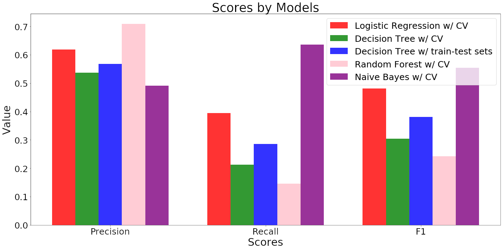

# Overview

The following is a Python/PySpark project that aims to predict the success of a Kickstarter campaign. Kickstarter is the most famous crowdsourcing company in the world, and being able to predict the success of a campaign on their platform could be a lucrative endeavour.

This project is based on the publicly available Kaggle dataset (link  [here](https://www.kaggle.com/kemical/kickstarter-projects)), courtesy of [Mickaël Mouillé](https://www.kaggle.com/kemical).

The dataset contains 2 dated .csv files, the most recent of which lists 300,000+ unique campaigns.

# Tech Stack Used

This project relies on only four libraries: NumPy, Matplotlib, Kaggle, and PySpark.

```sh
$ pip install numpy matplotlib kaggle pyspark
```

# Repository Content

The project **contains full Machine Learning pipelines** (data processing and modeling) relying on Apache Spark. **Overall 4 types of machine learning models were implemented**, using either cross-validation or a train-test spliting for evaluation. The models are:

1. Logistic Regression
2. Decision Tree Classifier
4. Random Forest
5. Naive Bayes

Their implementations are shared between two identical notebooks:

- **spark-pipeline_vLocal.ipynb**: This notebook was ran locally on a 20% random sample of the whole dataset
- **spark-pipeline_vGoogleCloud.ipynb**: this notebook was ran on Google Cloud ``Dataproc`` using a Standard Cluster running a 1.3-Debian10 image (release 08/16/2018) with Component Gateway, Anaconda and Jupyter Notebook enabled

Each Notebook contains 2 discontinued sections related to implementing a dense neural network using Elephas and BigDL (issue regarding environment on Google Cloud) are also present, albeit commented out using the RawNBConvert cell type.

# Post-Mortem and Conclusions

Running the models yielded the following results:



**Our most *precise* model is the Random Forest with cross-validation**. However, the model is precise *at the cost of recall* -- it implies that the model has a low level of false positives but a high level of false negatives (incidentally the most out of all the models tried out in this project).

Still, our goal is to look at whether a campaign on Kickstarter is successful or not. We want to identify the successful ones the most. Taking this into consideration, having some amount of false positives is **less important than reducing our amount of false negatives (i.e. we want to increase our Recall)**. 

If we are looking at ***recall* alone**, **Naive Bayes becomes the most interesting model**. But we need to go one step further. Our dataset is somewhat imbalanced and thus we should prefer a more generic metrics than just precision or recall. 

**Reminder:**

$$precision = \frac{True Positives}{True Positives+False Positives}\quad recall = \frac{True Positives}{True Positives + False Negatives}$$

That's where the F1 score comes into play.

$$F1 = 2*\frac{Precision * Recall}{Precision + Recall}$$


The F1 score is a type of mean between precision and recall. It is a generic measure of accuracy. And here we find that, indeed, our **Naive Bayes with cross-validation model has a the highest accuracy** out of all the models we tried out with the following final scores:

| Metrics | Scores obtained on Google Cloud | Scores obtained Locally |
| :--- | :--- | :--- |
| Precision | 0.492 | 0.492 |
| Recall | 0.636 | 0.638 |
| F1 | 0.555 | 0.555 |

**Note:** We see that there is no real difference between our local implementation compared to the implementation run on Google Cloud, *despite the former using only 20% of the dataset used by the latter*. This might imply that the models have hit a performance ceiling and other machine learning methods should be implemented. Such a model could employ a Recurrent Neural Network that would consume an embedded representation of the feature column ``name`` available in the dataset (name contains the title of the campaign, which is by itself a very important String value that tells us a lot about the marketing involved in the campaign).